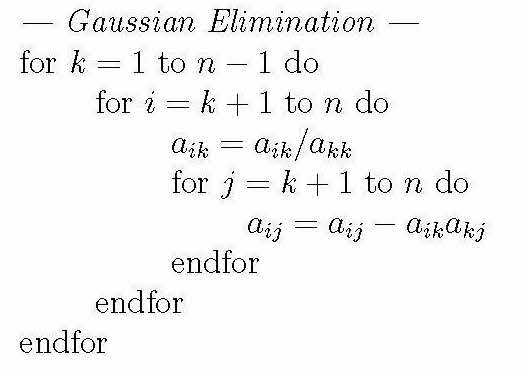
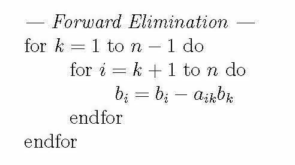
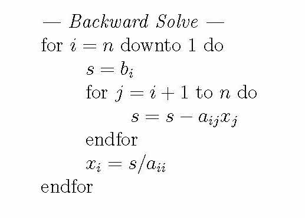

# Gaussian Elimination

## Algorithm (from http://www.math-cs.gordon.edu/courses/ma342/handouts/gauss.pdf)

Following the pseudocode available at the above link, we are going to break our algorithm into three parts:

1. Gaussian Elimination
2. Forward Elimination
3. Backward Solve

### Gaussian Elimination

The gist of this step is to transform our matrix to an upper triangular matrix by finding **pivots**, using the pivots to determine multiplicative factors

**Note:** this pseudocode assumes indexing starts at one. We will need to modify this for Python which starts at zero.

For the $k^{th}$ row we identify the $k^{th}$ column; this is the **pivot**. For each row $i; i > k$, we find the multiplier ($f_{ki}$) such that when we multiply row $k$ by

## Backward Substitution

